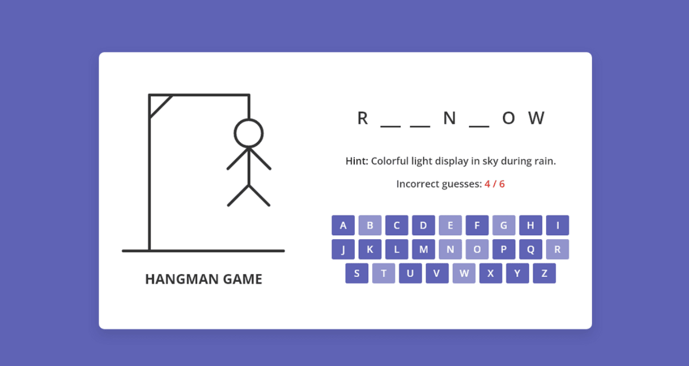

# 🎮 Hangman Game

An interactive word guessing game built using JavaScript.

---

## 🚀 Features

* Dynamic keyboard (A–Z)
* Random word selection
* Displays hints for each word
* Tracks incorrect guesses
* Game over and play again functionality
* Clean and responsive UI

---

## 📸 Screenshot



---

## 🌐 Live Demo

👉 [Explore Here](https://htmlpreview.github.io/?https://github.com/way2masoom/JavaScriptProjects/blob/main/HangmanGame/index.html)

---

## 📁 Project Structure

```id="m5r1s8"
HangmanGame/
│── index.html
│── style.css
│── script.js
│── word-list.js
│── images/
```

---

## 🧠 What I Learned

* DOM Manipulation
* Event Handling
* Game Logic Implementation
* Dynamic UI updates
* Working with arrays and objects

---

## ⚙️ How to Run

1. Clone the repository
2. Open `index.html` in your browser

---

## 👨‍💻 Author

Built with ❤️ by MD Masoom Alam

[GitHub](https://github.com/way2masoom)
[LinkedIn](https://www.linkedin.com/in/way2masoom/)

---

## ⭐ Support

If you found this project useful, consider giving it a ⭐ on GitHub!
