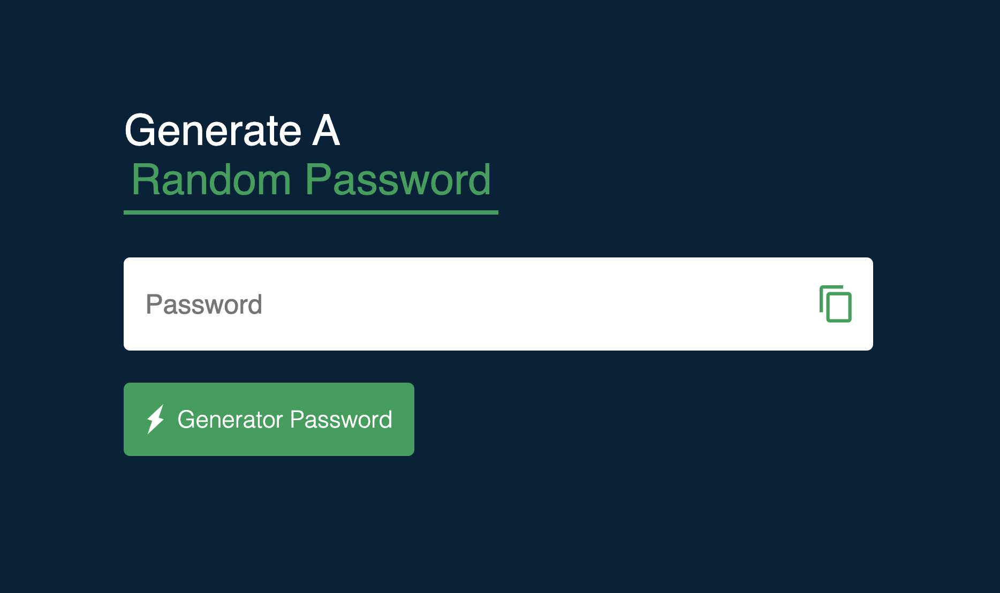

# 🔐 Password Generator

A simple and secure password generator built using JavaScript.

---

## 🚀 Features

* Generate strong random passwords
* Includes uppercase, lowercase, numbers, and symbols
* Copy password to clipboard
* Clean and responsive UI

---

## 📸 Screenshot



*(Add your screenshot inside images folder and name it screenshot.png)*

---

## 🌐 Live Demo

👉 https://htmlpreview.github.io/?https://github.com/way2masoom/JavaScriptProjects/blob/main/Password-Generator/index.html


---

## 📁 Project Structure

```
Password-Generator/
│── index.html
│── style.css
│── script.js
│── images/
```

---

## 🧠 What I Learned

* DOM Manipulation
* Random number generation
* Clipboard API
* UI/UX improvements

---

## ⚙️ How to Run

1. Clone the repo
2. Open `index.html` in browser

---

## 🙌 Author

Masoom Alam
