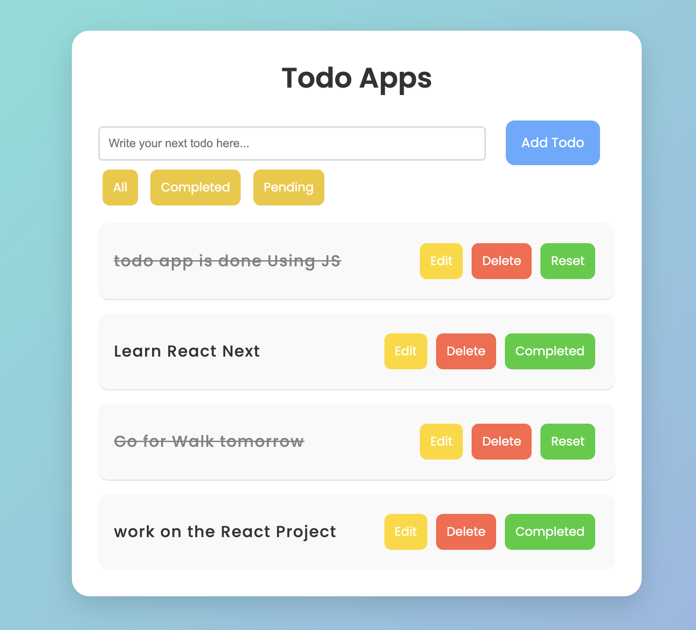
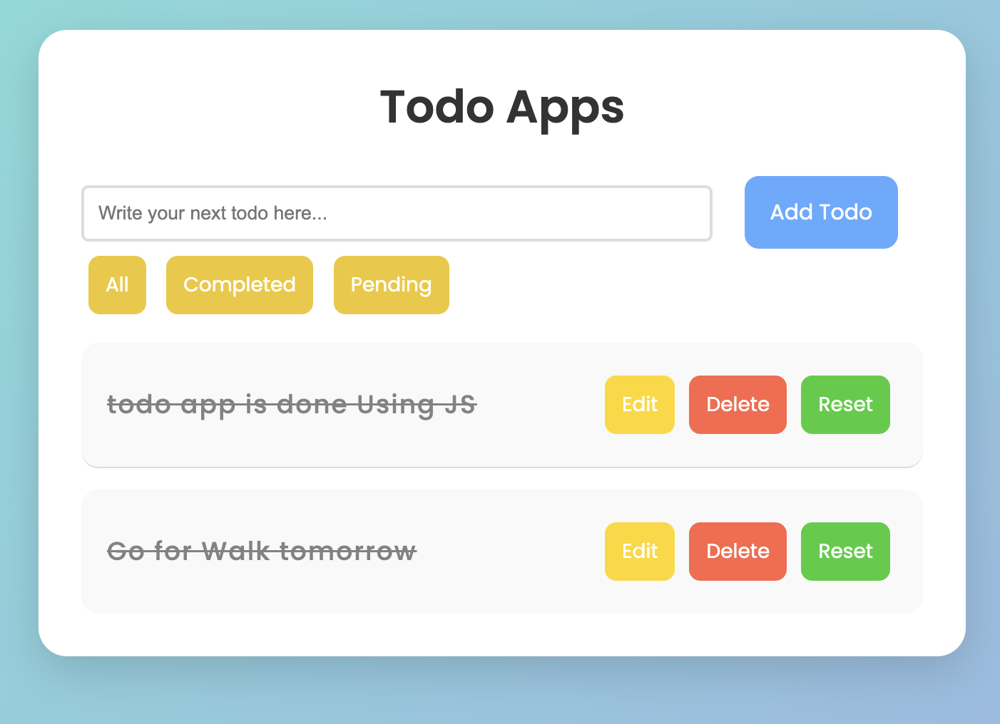
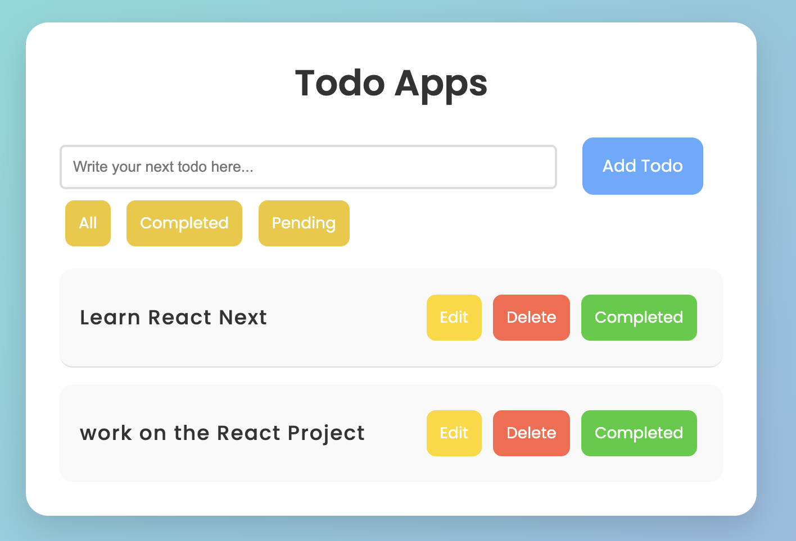

# ✅ Todo App

A modern and responsive Todo App built using JavaScript to manage daily tasks efficiently and improve productivity.

---

## 🚀 Features

* ➕ Add new tasks easily
* ⌨️ Add todos instantly by pressing the **Enter** key
* ✏️ Edit existing tasks anytime
* 🗑️ Delete tasks instantly
* ✅ Mark tasks as completed
* 🔄 Reset completed tasks back to pending
* 📂 Filter todos by:
  * All
  * Completed
  * Pending
* 💾 Stores todos using **LocalStorage**
* 📱 Fully responsive modern UI
* ⚡ Real-time dynamic task updates
* 🎨 Smooth animations and hover effects

---

## 📸 Screenshot

```md

```

Completed Preview

```md

```


Pending Preview

```md

```

---

## 🌐 Live Demo

👉 [Explore Here](https://htmlpreview.github.io/?https://github.com/way2masoom/JavaScriptProjects/blob/main/TodoApp/index.html)

---

## 📁 Project Structure

```bash
TodoApp/
│── index.html
│── style.css
│── function.js
│── TodoApp.png
```

---

## 🧠 What I Learned

* DOM Manipulation
* Event Handling in JavaScript
* Dynamic UI Rendering
* Working with Arrays & Objects
* LocalStorage Integration
* CRUD Operations
* Responsive Web Design
* JavaScript Functions & Events
* Mobile Responsive UI Design

---

## ⚙️ How to Run

1. Clone the repository

```bash
git clone https://github.com/way2masoom/JavaScriptProjects.git
```

2. Open the `TodoApp` folder

3. Run `index.html` in your browser

---

## 🙌 Author

### MD Masoom Alam

🔗 GitHub: https://github.com/way2masoom